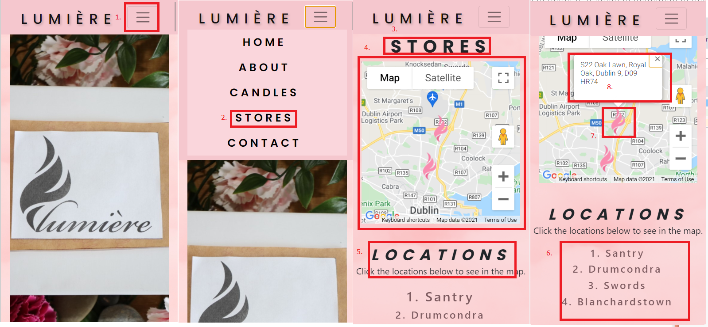
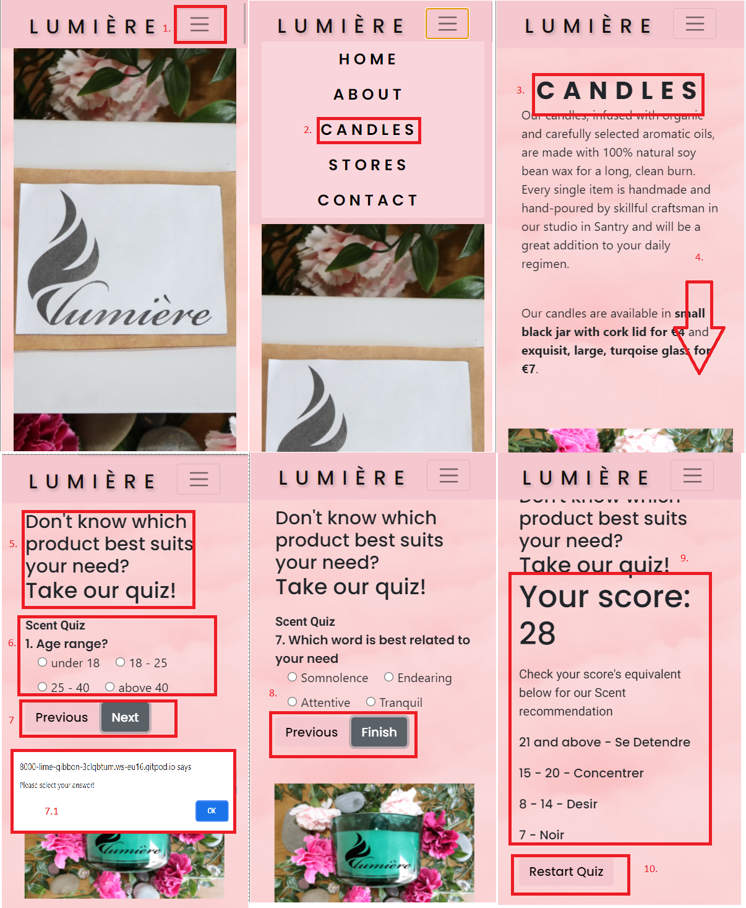

# Testing Section
## A. Code Validators

### a. [HTML Validation](https://validator.w3.org/#validate_by_input)  

- [index.html](docs/html-validation-img/index-html-validation.png)
- [feedback.html](docs/html-validation-img/feedback-html-validation.png)
- [404.html](docs/html-validation-img/404-html-validation.png)

### b. CSS Validation  
- 

    

       
### C. [Jshint Validation](https://jshint.com/)  

- [script.js](docs/jshint-valiation-img/jshintval-script.png)
- [quiz.js](docs/jshint-valiation-img/jshintval-quiz.png)
- [map.js](docs/jshint-valiation-img/jshintval-map.png)
- [email.js](docs/jshint-valiation-img/jshintval-email.png)

## B. Testing User Stories from User Experience Section

-   ### a. Artist's Fan Visitor Goals  

- **1. As a user (scented candle aficionado), I want to navigate the site easily so that I can find the content I am looking for.**  
        - Upon entering the site, the user will immediately be greeted with a typical site layout wherein the name of the site is displayed on the left side and the navigation links is at the right on which they can click to go to the desire page.  
        -All sections of the page are clearly separated and contains header to determine what is the content of that section.
        The footer sits at the bottom containing the social links and Subscription to Newsletter form.

- **2. As a user (scented candle aficionado), I want to get info about the company so that I can be aware of what company I am buying from.**  
        -There is a deicated About section in the page that gives a brief descripton of the brand.
  
1. On the Home at the top right corner of the page, click the About button (desktop)/  Toggler menu (hamburger icon) and click About on the dropdeown menu (mobile)
2. Scroll down to view the whole content  
  
- Desktop  
  

- Mobile  
 

- **3. As a user (scented candle aficionado), I want to know the variety of scented candles they are selling So that I can choose which one that suits me.**    
        -In the Candles section, containers used and the array of products of the brand are isplayed together with its name, image and escription of the product.

1. On the Home at the top right corner of the page, click the Candles button (desktop)/  Toggler menu (hamburger icon) and click Candles on the dropdeown menu (mobile)
2. Scroll down to view the whole content  
3. In the bottom most section of the the page, the list of all the scents available are listed.
4. The default image for the scent section is the small product and when it is hovered over it will change to a sample of the large product

- Desktop  
  

- Mobile  
 

- **4. As a user (scented candle aficionado), I want to be able to contact the company and receive feedback when doing so so that if I have question, I can ask them easily/ communicate if need be.**
        -There is Contact form that the the customer can fill in with his/her information should they have a message or query to brand.
        -Upon clicking the Send button, once the message has been sent, there will be a modal dialogue box giving feedback to the customer that the message has been sent.

1. On the Home at the top right corner of the page, click the Contact button (desktop)/  Toggler menu (hamburger icon) and click Contact on the dropdeown menu (mobile)
2. Scroll down to view the whole content  
3. Fill in the details required for a message to be sent.
4. After filling out the form, click Send.
5. A modal box will pop out as a feedback after successfully sending a message.

- Desktop  
  

- Mobile  
 

6. An email will be sent to the designated Email assigned in EmailJS.  

- Sample Email Sent to the assigned email address    

   

- **5. As a user (scented candle aficionado), I want to know the opening hours So that I will know what time I can visit and buy candles.**  
        -There is a dedicated section in the Stores Page regarding the opening hours of the shops.

1. On the Home at the top right corner of the page, click the Stores button (desktop)/  Toggler menu (hamburger icon) and click Stores on the dropdeown menu (mobile)
2. Scroll down to view the opening hours. 

- Desktop  
  

- Mobile  
 

- **6. As a user (scented candle aficionado), I want to know where the shops are So that I would know where to go.**    
        -In the Stores Page, a map connected with the Google map API can be foun wherein the stores branch can be seen on buttons above the map itself.
        -Upon clicking the location, tthe location will move in the center together with its marker.

1. On the Home at the top right corner of the page, click the Stores button (desktop)/  Toggler menu (hamburger icon) and click Stores on the dropdown menu (mobile).
2. Click the Branch location button on top of the map.
3. This will move the map marker of that store in center of the map.
4. Upon clicking the marker, it will show the exact location of that Store branch.

- Desktop  
  

- Mobile  
 

- **7. As a user (scented candle aficionado), I want to see what the product looks like So that I can have a visual on what to expect.**
        -Several photos were added in the website to showcase all products offered by the brand.

- **8. As a user (scented candle aficionado), I want to get notification regarding new releases and promos of the shop So that I can get updates and discounts.**    
        - The footer section, which sits at the bottom of every page, contains a simple form on which user can fill in in their Email Address and click the Subscription button to subscribe.  
        - The Subscribe button sits next to the Email and can be easily distinguished and intuitively clicked due to a contrasting colour to the Email input. 

1. On the Home at the top right corner of the page, click the Contact button (desktop)/  Toggler menu (hamburger icon) and click Contact on the dropdeown menu (mobile)
2. Scroll down to until the end of the page in the footer.  
3. Fill in your email address and click Subscribe.

- Desktop  
  

- Mobile  

4. Currently, this is non functional but you can receive a 404 Error upon subscribing.
5. Click the Return button to go back to the Home Page

- Desktop  
  

- Mobile  

- **9. As a user (scented candle aficionado), I want to know the socials of the company So that I can review comments and feedback from previous customers.**    
        - The footer section, which sits at the bottom of every page, contains icons to the brand’s social media accounts.  
        - When clicked, the icons are opened in a new tab so that users can easily go back the brand's site after viewing the social media account. 

1. On the Home at the top right corner of the page, click the Contact button (desktop)/  Toggler menu (hamburger icon) and click Contact on the dropdeown menu (mobile)
2. Scroll down to until the end of the page in the footer.  
3. Click on the social media icon an it will open a new page browser and you can view that account.

  

- Mobile  
 

- **10. As a user (scented candle aficionado), I want to be able to buy products online So that I would not need to go to the shop.**    
        -Currently, this is not a feature added. Customers may send a message and discuss payment and delivery thru the form.

- **11. As a user (scented candle aficionado), I want to be notified regarding request on the website So that I would know if I ‘m getting a response or not with my transactions and with what I am doing.**    
        -Feedback when using the contact form is a feature of the site to give customer response regaring if the message has been sent as well as a 404 error message if something went wrong or a page being accessed or a transaction is invalid.
  
-   ### b. Potential Fan Visitor Goals  
  
- **1. As a potential user (non- aficionado), I want to view the site simple so that I can browse with ease.**  
        - Upon entering the site, the user will immediately be greeted with a typical site layout wherein the name of the site is displayed on the left side and the navigation links is at the right on which they can click to go to the desire page.  
        -All sections of the page are clearly separated and contains header to determine what is the content of that section.
        The footer sits at the bottom containing the social links and Subscription to Newsletter form.  

- **2. As a potential user (non- aficionado), I want to be able to contact someone if I need be so that my questions can be answered.**    
        -There is Contact form that the the customer can fill in with his/her information should they have a message or query to brand.   

- **3. As a potential user (non- aficionado), I want to know which product best suit my need so it will be easy for me to know what item to buy.** 
        - In the candles section, there is an interactive quiz game on which upon completion of answering the questions, it will return a recommendation on what product best suits your needs.

1. On the Home at the top right corner of the page, click the Candles button (desktop)/  Toggler menu (hamburger icon) and click Candles on the dropdeown menu (mobile)
2. Scroll down to the Scent Quiz part.
3. Click the radio button to answer the questions and click Next. If a question is not answered, there will be a pop up to tell you that you haven't click an answer.
4. Upon successfully answering all the questions, the Next button will change to Finish.
5. Click Finish an it will show the result.
6. The Prev and Finish button will change to Restart. You may click this after reading your answer and you will be reirected to the Home Page or you may continue scrolling own to view the Scent that best suits you.

-  

- Mobile  
 

-   ### c. Site Owner Goals

- **1. As the site owner, I want to create a website so that I can establish an online presence.**  
        - The website was created containing images of the products offered by the company.
        - It also contains a Subscription Form to a Newsletter and icons linked to the brand's social media accounts.  

- **2. As the site owner, I want to share the goals and objectives of the company so that people can know what kind of company we have.**   
        - There is a dedicated About Page regaring the brand's goals and objectives in setting up this business.

- **3. As the site owner, I want clients to be to contact us so that we could provide better customer service and profit can increase.**  
        - There is a dedicate Contact form on which customers can get in touch with the brand.

- **4. As the site owner, I want the site to embody ease, relaxation and mindfulness while browsing and provide visual pleasure to the eyes so that clients will be encouraged to come back and visit the site again.**   
        - The overall layout, design and feel of the site is to embody ease, relaxation and mindfulness. The design, colours and typography used were chosen to achieve this.  

- **5. As the site owner, I want to increase traffic in the site so that we can increase profitability.**    
        - The layout was designed according to user stories from scented-candles aficionado an potential users. It provides a simple and intuitive website that users can use with ease and confidence. By doing so, the website creator hopes to increase the traffic in the site thereby increasing the number of users revisiting the site. 

## C. Chrome dev tool  

### Lighthouse    
  
Lighthouse Testing before my second mentor session was done.  
      
-[**Desktop**](docs/lighthouse-testing-img/lighthouse-desktop.png)  
-[**Mobile**](docs/lighthouse-testing-img/lighthouse-mobile.png) 

## C. Issues/ Bugs  

- [Layout bug in modal response](docs/issues-img/modal-layout-issue.png) for the contact form, overlapping close button, text and container in mobile. *Fixed*   
        -This was fixed using media query in mobile view by adjusting `#modal` declaration to same.

- There was an order issue with the html content of the Candles Sections. *Fixed*  
        -This was fixed using Bootstrap's `order` class added on different `div` elements in the Candles Sections.Tinypng for compressing image.

- Map was not loading. *Fixed* 
        -This was addressed by ensuring that API key restriction is correct in the [Google Maps platform](https://console.cloud.google.com/google/maps-apis/credentials?_ga=2.99415582.165884211.1631186928-404668751.1619166239&project=my-project-resume-322509).

- Quiz result not showing. *Fixed* 
        -`div` elements in the Quiz section were re-arranged in the index.html file.  

- Layout bug in About section, overlapping elements in different devices. *Fixed*   
        -This was fixed using `@media queries` and padding ajustments.  

- Google/ EmailJs as undefined variable in Jshint. *Fixed*   
        -Added `/*global google*/` and `/*global emailjs*/` on line1 in their respective JavaScript files.

- [`'template literal syntax is only available in ES6 ('use esversion: 6')'`](docs/issues-img/jshint-error-issue1.png) and [`'arrow function syntax (=>)' is only available in ES6 (use 'esversion: 6').`](docs/issues-img/jshint-error-issue2.png) warning in Jshint.  *Partially fixed*  
        -I created .jshintrc in the root directory of the project and coded `{"esversion": 6}` but the warnings did not disappear. After consulting with Tutor support, I was advised that i can just leave it as it is.  

- The modal response for the contact form takes a few seconds before giving feedback but working. *Not fixed*  

- Wide spacing between bullet an list item. *Fixed*   
        -Used `list-style-position:inside;` to target `ol` element  
    
## D. Supported Browsers

- The Website was tested on Google Chrome, Microsoft Edge and Mozilla Firefox browsers. 

## E. Testing for Supported Devices

- The websites each page was viewed and tested in Chrome Dev tool using different breakpoints emmanating the width and size of different desktop, laptop, and mobile devices. It was also on desktop view for Microsoft Edge an Mozilla Firefox.

- The site was tested for Galaxy Notes II, Galaxy S III, Moto G4, Galaxy S5, Pixel 2, Pixel 2XL, iPhone6/7/8, iPhone6/7/8 Plus, iPad, iPad Pro, and Surface Duo.  

- Please see attached file for the [table result](docs/lumiere-testing-sheet.xlsx).  

- A large amount of testing was done to ensure that all pages were linking correctly.

## F. Further Testing

- Friends and family members were asked to review the site and documentation to point out any bugs and/or user experience issues.